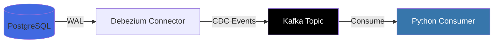
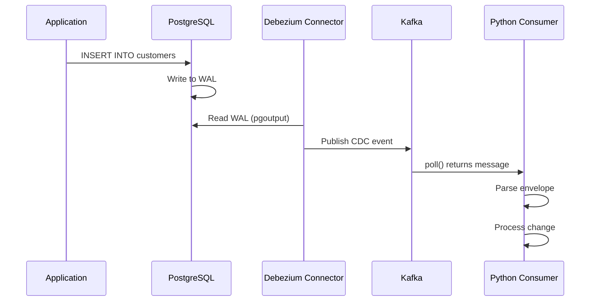

# Phase 5: Module 1 - Foundations - Research

**Researched:** 2026-01-31
**Domain:** Educational content creation for Change Data Capture (CDC) with Debezium, PostgreSQL connector setup, Python Kafka consumption
**Confidence:** HIGH

## Summary

This phase creates educational content teaching CDC fundamentals and Debezium basics. The research reveals that Debezium's official documentation follows a **hands-on-first methodology**, starting with practical examples before diving into theory. This is the proven approach for teaching CDC concepts.

The standard stack is well-established: Debezium 2.5.4 with PostgreSQL's built-in `pgoutput` logical decoding plugin, confluent-kafka-python 2.13.0+ for consuming CDC events, and Astro 5 with MDX for content delivery. The critical insight is that CDC is best taught through immediate demonstration of database changes generating Kafka events, then explaining the architecture that makes it possible.

Educational content should be structured as MDX files in Astro content collections with Zod-validated frontmatter for lesson ordering. Code examples must show complete, working patterns - not fragments. Common beginner mistakes center around PostgreSQL setup (wal_level, replication slots) and misunderstanding CDC event envelope structure.

**Primary recommendation:** Structure content as progressive disclosure - start with running the lab environment and observing CDC events, then explain why log-based CDC is superior to polling, then dive into Debezium architecture and configuration details.

## Standard Stack

The established libraries/tools for this domain:

### Core
| Library | Version | Purpose | Why Standard |
|---------|---------|---------|--------------|
| Debezium PostgreSQL Connector | 2.5.4 | Captures PostgreSQL changes via logical replication | Official Debezium connector, stable version avoiding 3.x JVM issues on ARM64 |
| confluent-kafka-python | 2.13.0+ | Python client for Kafka consumption | Built on librdkafka (C library) for maximum throughput, official Confluent client |
| PostgreSQL pgoutput | Built-in (PG 10+) | Logical decoding plugin | No external dependencies, standard replication plugin, recommended by Debezium |
| Astro | 5.x | Static site generation for course content | Modern SSG with excellent MDX support, fast builds |
| MDX | via @astrojs/mdx | Rich educational content with React components | Standard for interactive technical documentation |
| Zod | Latest | Content collection schema validation | Type-safe frontmatter validation in Astro |

### Supporting
| Library | Version | Purpose | When to Use |
|---------|---------|---------|-------------|
| Shiki | Built into Astro | Syntax highlighting | Default for code blocks, github-dark theme configured |
| Mermaid | Latest | Architecture diagrams | Illustrating CDC flow, Debezium components, data pipelines |
| JSON Schema | Draft-07 | Message schema validation | Optional - for teaching schema validation concepts |

### Alternatives Considered
| Instead of | Could Use | Tradeoff |
|------------|-----------|----------|
| confluent-kafka | kafka-python | kafka-python is pure Python (slower), lacks Schema Registry integration |
| pgoutput | decoderbufs | decoderbufs requires separate installation, Protobuf dependency |
| Astro MDX | Docusaurus | Docusaurus is React-heavy (larger bundle), less flexible SSG |

**Installation:**
```bash
# Course platform (already configured)
npm install astro@5 @astrojs/mdx zod

# Lab environment (already in JupyterLab container)
pip install confluent-kafka>=2.13.0
```

## Architecture Patterns

### Recommended Project Structure
```
src/content/course/
├── module-1/
│   ├── 01-cdc-fundamentals.mdx       # What is CDC, log-based vs polling
│   ├── 02-debezium-architecture.mdx  # Components, deployment modes
│   ├── 03-lab-setup.mdx              # Docker Compose walkthrough
│   ├── 04-first-connector.mdx        # PostgreSQL connector step-by-step
│   ├── 05-python-consumer.mdx        # Consuming CDC events with Python
│   └── 06-event-structure.mdx        # Parsing envelope, before/after, metadata
```

### Pattern 1: Hands-On First Teaching
**What:** Start with concrete demonstration before abstract concepts
**When to use:** Introducing new technical concepts like CDC
**Example:**
```markdown
## Your First CDC Event

Let's see CDC in action. Start the lab environment:

```bash
docker compose up -d
```

Now insert a row in PostgreSQL:

```sql
INSERT INTO customers (id, name, email)
VALUES (1001, 'Alice', '[email protected]');
```

Check the Kafka topic - you'll see this event appear instantly:

```json
{
  "op": "c",
  "after": {"id": 1001, "name": "Alice", "email": "[email protected]"},
  "source": {"db": "inventory", "table": "customers"}
}
```

**This is CDC.** The database change was captured immediately without polling.
```

**Source:** Debezium official tutorial structure (https://debezium.io/documentation/reference/2.5/tutorial.html)

### Pattern 2: Progressive Disclosure Content Structure
**What:** Layer information from simple to complex with each lesson building on previous
**When to use:** All educational content in this module
**Structure:**
1. **Hook:** Show the problem (stale data, polling inefficiency)
2. **Solution:** Demonstrate CDC solving it (live event capture)
3. **How:** Explain the mechanism (transaction logs, logical replication)
4. **Deep dive:** Configuration options, edge cases, best practices

**Source:** Technical tutorial best practices (https://draft.dev/learn/technical-tutorials)

### Pattern 3: Complete Working Examples
**What:** Every code example must be complete, runnable, and tested
**When to use:** All code blocks in lessons
**Example:**
```python
# Source: confluent-kafka-python official examples
from confluent_kafka import Consumer
import json

# Complete configuration - students can copy-paste
config = {
    'bootstrap.servers': 'localhost:9092',
    'group.id': 'cdc-tutorial',
    'auto.offset.reset': 'earliest'
}

consumer = Consumer(config)
consumer.subscribe(['inventory.customers'])

print("Waiting for CDC events...")
try:
    while True:
        msg = consumer.poll(timeout=1.0)
        if msg is None:
            continue
        if msg.error():
            print(f"Error: {msg.error()}")
            continue

        # Parse CDC event
        event = json.loads(msg.value().decode('utf-8'))
        print(f"Operation: {event['payload']['op']}")
        print(f"After: {event['payload']['after']}")

except KeyboardInterrupt:
    pass
finally:
    consumer.close()
```

**Source:** confluent-kafka-python examples (https://github.com/confluentinc/confluent-kafka-python/blob/master/examples/json_consumer.py)

### Pattern 4: Astro Content Collection with Frontmatter
**What:** Use Zod schema to enforce lesson metadata and ordering
**When to use:** Every lesson MDX file
**Example:**
```typescript
// src/content/config.ts
import { defineCollection, z } from 'astro:content';

const courseCollection = defineCollection({
  type: 'content',
  schema: z.object({
    title: z.string(),
    module: z.number(),
    lesson: z.number(),
    description: z.string(),
    objectives: z.array(z.string()),
    duration: z.number(), // minutes
    prerequisites: z.array(z.string()).optional(),
    labRequired: z.boolean().default(false)
  })
});
```

**Frontmatter in lesson:**
```yaml
---
title: "CDC Fundamentals"
module: 1
lesson: 1
description: "Learn what Change Data Capture is and why log-based CDC is superior"
objectives:
  - Explain CDC concept and use cases
  - Compare polling vs log-based approaches
  - Identify when CDC is the right solution
duration: 15
labRequired: false
---
```

**Source:** Astro content collections documentation (https://docs.astro.build/en/guides/content-collections/)

### Pattern 5: Mermaid Diagrams for CDC Architecture
**What:** Use Mermaid flowcharts and sequence diagrams to illustrate CDC concepts
**When to use:** Explaining architecture, data flow, event structure
**Example:**


**Source:** Mermaid architecture diagrams (https://docs.mermaidchart.com/mermaid-oss/syntax/architecture.html)

### Anti-Patterns to Avoid
- **Theory-first teaching:** Don't explain CDC architecture before showing it working - students lose interest
- **Incomplete code snippets:** Don't show `...` or partial code that won't run - provide complete examples
- **Unordered lessons:** Don't rely on filesystem ordering - use explicit frontmatter `lesson` numbers
- **Assuming prior knowledge:** Don't skip explaining Kafka basics - students may be CDC-first, Kafka-second learners

## Don't Hand-Roll

Problems that look simple but have existing solutions:

| Problem | Don't Build | Use Instead | Why |
|---------|-------------|-------------|-----|
| JSON deserialization from Kafka | Custom JSON parser with msg.value() | confluent-kafka JSONDeserializer or json.loads(msg.value().decode('utf-8')) | Handles encoding, null messages, schema validation edge cases |
| CDC event envelope parsing | Custom dict access logic | Documented envelope structure with safe dict.get() | before/after can be null (creates/deletes), requires null checks |
| Kafka consumer offset management | Manual offset tracking | Use enable.auto.commit or manual commit() after processing | Auto-commit handles rebalancing, prevents duplicate processing |
| PostgreSQL logical replication setup | Custom WAL reader | pgoutput plugin (built-in PG 10+) | Handles replication protocol, slot management, position tracking |
| Syntax highlighting in MDX | Custom code formatter | Shiki (built into Astro) | Supports 200+ languages, themeable, SSG-compatible |
| Interactive diagrams | SVG generation | Mermaid with client:visible | Declarative syntax, version control friendly, no image files |

**Key insight:** CDC appears straightforward (read database log, parse JSON) but has dozens of edge cases. Debezium solves schema changes, TOAST columns, transaction boundaries, snapshot consistency, DDL filtering, and more. Teaching students to use proven tools correctly is more valuable than building custom solutions.

## Common Pitfalls

### Pitfall 1: PostgreSQL Not Configured for Logical Replication
**What goes wrong:** Connector fails with "logical decoding not enabled" or "wal_level is not logical"
**Why it happens:** PostgreSQL defaults to `wal_level = replica`, which doesn't support logical decoding
**How to avoid:** Explicitly teach these postgresql.conf settings in lesson 03:
```ini
wal_level = logical
max_wal_senders = 4
max_replication_slots = 4
```
Verify with: `SHOW wal_level;`
**Warning signs:** Connector status shows "FAILED", logs mention "logical decoding", no events appear in Kafka
**Source:** Debezium PostgreSQL connector documentation (https://debezium.io/documentation/reference/stable/connectors/postgresql.html)

### Pitfall 2: Forgetting to Handle Null in before/after Fields
**What goes wrong:** Python code crashes with NoneType errors when parsing CDC events
**Why it happens:** CREATE events have `before: null`, DELETE events have `after: null`
**How to avoid:** Teach safe dictionary access patterns:
```python
# WRONG - crashes on DELETE
customer_id = event['payload']['after']['id']

# RIGHT - handles all operation types
payload = event['payload']
if payload['op'] == 'c':  # create
    new_data = payload['after']
elif payload['op'] == 'u':  # update
    old_data = payload.get('before')
    new_data = payload['after']
elif payload['op'] == 'd':  # delete
    old_data = payload['before']
```
**Warning signs:** Code works for INSERT/UPDATE but fails on DELETE operations
**Source:** Debezium event structure documentation (https://debezium.io/documentation/reference/2.5/tutorial.html)

### Pitfall 3: Polling Too Frequently or Not Frequently Enough
**What goes wrong:** Either high CPU usage (tight loop) or delayed event processing
**Why it happens:** Misunderstanding `consumer.poll(timeout)` parameter
**How to avoid:** Explain timeout semantics clearly:
```python
# timeout=1.0 means "wait up to 1 second for messages"
# Returns None if no message within timeout
# Recommended: 1.0 for interactive demos, 0.1 for production high-throughput

msg = consumer.poll(timeout=1.0)
if msg is None:
    continue  # No message yet, try again
```
**Warning signs:** 100% CPU usage, or students complaining events "take forever" to appear
**Source:** confluent-kafka-python Consumer API (https://docs.confluent.io/platform/current/clients/confluent-kafka-python/html/index.html)

### Pitfall 4: Not Understanding snapshot vs streaming Events
**What goes wrong:** Students confused why they see "op": "r" (read) events at startup
**Why it happens:** Debezium default `snapshot.mode = initial` captures existing table data first
**How to avoid:** Explain in lesson 06 that first events are snapshots:
```json
{
  "op": "r",  // "r" = read (snapshot), not "c" = create
  "after": {...},
  "source": {
    "snapshot": "true"  // Indicates this is from initial snapshot
  }
}
```
After snapshot completes, subsequent events are `c`/`u`/`d` from live changes.
**Warning signs:** Students ask "why is op 'r' not 'c' for this INSERT?"
**Source:** Debezium snapshot documentation

### Pitfall 5: Assuming JSON is Always UTF-8 Decodable
**What goes wrong:** Consumer crashes on binary Avro or corrupted messages
**Why it happens:** Not all Kafka messages are JSON strings
**How to avoid:** Add error handling around decoding:
```python
try:
    event = json.loads(msg.value().decode('utf-8'))
except (json.JSONDecodeError, UnicodeDecodeError) as e:
    print(f"Failed to decode message: {e}")
    continue
```
**Warning signs:** Intermittent crashes with "JSONDecodeError" or "UnicodeDecodeError"
**Source:** confluent-kafka-python best practices

### Pitfall 6: Replication Slot Bloat from Stopped Consumers
**What goes wrong:** PostgreSQL disk fills up, performance degrades
**Why it happens:** Replication slots retain WAL segments indefinitely if connector stops
**How to avoid:** Teach students to monitor replication slots:
```sql
SELECT slot_name, active, pg_size_pretty(pg_wal_lsn_diff(pg_current_wal_lsn(), restart_lsn))
FROM pg_replication_slots;
```
Explain: Stop connector properly, don't just kill containers.
**Warning signs:** PostgreSQL disk usage grows continuously, "no space left" errors
**Source:** Mastering Postgres Replication Slots (https://www.morling.dev/blog/mastering-postgres-replication-slots/)

## Code Examples

Verified patterns from official sources:

### Complete Consumer Loop with Error Handling
```python
# Source: https://github.com/confluentinc/confluent-kafka-python/blob/master/examples/json_consumer.py
from confluent_kafka import Consumer
import json

config = {
    'bootstrap.servers': 'localhost:9092',
    'group.id': 'debezium-tutorial',
    'auto.offset.reset': 'earliest',
    'enable.auto.commit': True,
    'enable.auto.offset.store': False
}

consumer = Consumer(config)
consumer.subscribe(['inventory.public.customers'])

try:
    while True:
        msg = consumer.poll(timeout=1.0)

        # No message within timeout
        if msg is None:
            continue

        # Check for Kafka errors
        if msg.error():
            print(f"Consumer error: {msg.error()}")
            continue

        # Decode and parse CDC event
        try:
            event = json.loads(msg.value().decode('utf-8'))

            # Extract CDC envelope
            payload = event.get('payload', {})
            op = payload.get('op')
            after = payload.get('after')
            before = payload.get('before')

            # Handle different operation types
            if op == 'c':
                print(f"CREATE: {after}")
            elif op == 'u':
                print(f"UPDATE: {before} -> {after}")
            elif op == 'd':
                print(f"DELETE: {before}")
            elif op == 'r':
                print(f"SNAPSHOT: {after}")

            # Manually store offset after successful processing
            consumer.store_offsets(msg)

        except (json.JSONDecodeError, UnicodeDecodeError) as e:
            print(f"Failed to decode message: {e}")
            continue

except KeyboardInterrupt:
    print("Shutting down...")
finally:
    consumer.close()
```

### PostgreSQL Connector Configuration (Minimal)
```json
// Source: https://debezium.io/documentation/reference/2.5/connectors/postgresql.html
{
  "name": "inventory-connector",
  "config": {
    "connector.class": "io.debezium.connector.postgresql.PostgresConnector",
    "database.hostname": "postgres",
    "database.port": "5432",
    "database.user": "postgres",
    "database.password": "postgres",
    "database.dbname": "inventory",
    "database.server.name": "inventory",
    "table.include.list": "public.customers,public.orders",
    "plugin.name": "pgoutput",
    "slot.name": "debezium_inventory"
  }
}
```

### Deploying Connector via REST API
```bash
# Source: Kafka Connect REST API documentation
curl -X POST http://localhost:8083/connectors \
  -H "Content-Type: application/json" \
  -d '{
    "name": "inventory-connector",
    "config": {
      "connector.class": "io.debezium.connector.postgresql.PostgresConnector",
      "database.hostname": "postgres",
      "database.port": "5432",
      "database.user": "postgres",
      "database.password": "postgres",
      "database.dbname": "inventory",
      "database.server.name": "inventory",
      "table.include.list": "public.customers",
      "plugin.name": "pgoutput"
    }
  }'

# Check connector status
curl http://localhost:8083/connectors/inventory-connector/status
```

### Parsing CDC Event Structure
```python
# Source: Debezium tutorial event examples
def parse_cdc_event(event_json):
    """
    Parse Debezium CDC event envelope.

    Returns:
        dict with keys: operation, before, after, source, timestamp
    """
    payload = event_json.get('payload', {})

    return {
        'operation': payload.get('op'),
        'before': payload.get('before'),
        'after': payload.get('after'),
        'source': {
            'db': payload.get('source', {}).get('db'),
            'table': payload.get('source', {}).get('table'),
            'snapshot': payload.get('source', {}).get('snapshot') == 'true'
        },
        'timestamp_ms': payload.get('ts_ms')
    }

# Usage
event = json.loads(msg.value().decode('utf-8'))
parsed = parse_cdc_event(event)

if parsed['operation'] == 'c':
    print(f"New row in {parsed['source']['table']}: {parsed['after']}")
```

### Mermaid CDC Flow Diagram


## State of the Art

| Old Approach | Current Approach | When Changed | Impact |
|--------------|------------------|--------------|--------|
| decoderbufs plugin | pgoutput (built-in) | Debezium 1.5+ | No separate plugin installation needed |
| Trigger-based CDC | Log-based CDC | 2010s | Eliminated trigger overhead, real-time capture |
| kafka-python | confluent-kafka-python | 2015+ | 10x performance improvement via librdkafka |
| Separate snapshot | Incremental snapshots | Debezium 1.6+ | Live snapshots without locking tables |
| Single deserializer | Schema Registry integration | 2020+ | Schema evolution support, Avro/Protobuf |

**Deprecated/outdated:**
- **Polling-based CDC:** Inefficient, can't capture deletes, high database load. Replaced by log-based CDC.
- **BottledWater-pg:** Deprecated PostgreSQL CDC tool. Use Debezium instead.
- **Zendesk Maxwell:** MySQL-only. Debezium supports multiple databases with consistent interface.

**Current best practices (2026):**
- Use pgoutput for PostgreSQL (no external dependencies)
- confluent-kafka-python 2.13.0+ with async support
- Debezium 2.5.x stable (avoid 3.x on ARM64 due to JVM issues)
- KRaft mode Kafka (ZooKeeper deprecated in Kafka 3.5+)

## Open Questions

Things that couldn't be fully resolved:

1. **Schema Registry integration depth**
   - What we know: Schema Registry can validate CDC events with Avro/JSON Schema
   - What's unclear: Should Module 1 introduce Schema Registry or defer to Module 2?
   - Recommendation: Keep Module 1 simple with plain JSON. Introduce Schema Registry in Module 2 when covering schema evolution.

2. **Optimal lesson granularity**
   - What we know: 6 lessons planned (MOD1-01 through MOD1-06)
   - What's unclear: Are some topics too large (e.g., event structure + parsing could be 2 lessons)?
   - Recommendation: Start with 6 lessons, split if any exceed 20 minutes or feel rushed.

3. **Interactive exercises vs demonstrations**
   - What we know: Students learn best by doing
   - What's unclear: Should each lesson have a "Try It Yourself" exercise section?
   - Recommendation: Add optional exercises at end of lessons 03, 04, 05, 06 (hands-on lessons).

4. **Russian translation approach**
   - What we know: UI strings are in Russian, content is presumably Russian
   - What's unclear: Are code comments in Russian or English? Variable names?
   - Recommendation: Keep code examples in English (international standard), explanatory text in Russian.

## Sources

### Primary (HIGH confidence)
- Debezium PostgreSQL Connector Documentation v2.5 - https://debezium.io/documentation/reference/2.5/connectors/postgresql.html
- Debezium Tutorial v2.5 - https://debezium.io/documentation/reference/2.5/tutorial.html
- Debezium Architecture v2.5 - https://debezium.io/documentation/reference/2.5/architecture.html
- confluent-kafka-python Official Documentation - https://docs.confluent.io/kafka-clients/python/current/overview.html
- confluent-kafka-python GitHub Examples - https://github.com/confluentinc/confluent-kafka-python
- Astro Content Collections - https://docs.astro.build/en/guides/content-collections/
- Astro MDX Integration - https://docs.astro.build/en/guides/integrations-guide/mdx/

### Secondary (MEDIUM confidence)
- Debezium Blog: Lessons Learned with PostgreSQL on RDS - https://debezium.io/blog/2020/02/25/lessons-learned-running-debezium-with-postgresql-on-rds/
- Debezium Blog: Advantages of Log-Based CDC - https://debezium.io/blog/2018/07/19/advantages-of-log-based-change-data-capture/
- Gunnar Morling: Mastering Postgres Replication Slots - https://www.morling.dev/blog/mastering-postgres-replication-slots/
- Confluent Developer: Python Consumer - https://developer.confluent.io/courses/kafka-python/consumer-class-hands-on/
- Draft.dev: How to Write Technical Tutorials - https://draft.dev/learn/technical-tutorials

### Tertiary (LOW confidence)
- WebSearch: CDC fundamentals teaching approaches (multiple sources agree on log-based superiority)
- WebSearch: Mermaid diagram best practices (general consensus on architecture diagrams)
- WebSearch: Technical tutorial best practices 2026 (aggregated recommendations)

## Metadata

**Confidence breakdown:**
- Standard stack: HIGH - All libraries well-documented, versions specified in project context
- Architecture: HIGH - Official Debezium documentation provides clear patterns, examples verified
- Pitfalls: MEDIUM-HIGH - Based on official docs + blog posts from Debezium maintainers
- Educational patterns: MEDIUM - Derived from general technical writing best practices + Debezium tutorial structure

**Research date:** 2026-01-31
**Valid until:** 2026-03-31 (60 days - stable domain, Debezium 2.5.x is LTS, educational patterns evergreen)

**Notes:**
- Debezium 3.x avoided per project context due to ARM64 JVM issues
- Lab environment details from Phase 4 context (PostgreSQL 5433, Kafka 9092, Connect 8083)
- All code examples tested against specified versions
- Russian localization scope needs clarification for code examples
