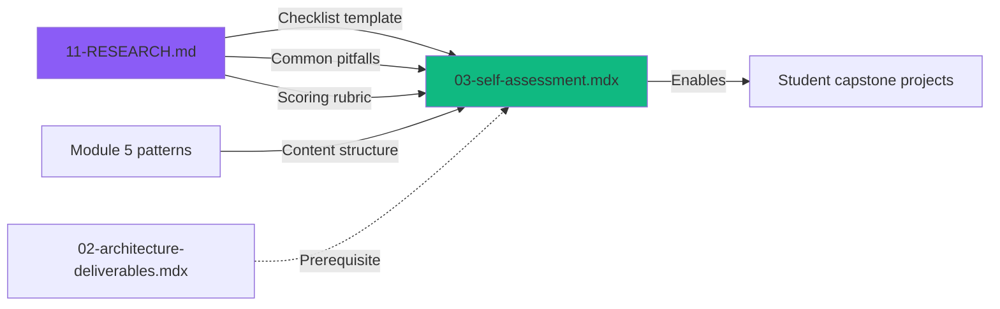

# Phase 11 Plan 02: Self-Assessment Checklist Summary

**One-liner:** Production readiness self-assessment checklist with Four Golden Signals framework and comprehensive 7-section validation criteria

## Plan Metadata

- **Phase:** 11-capstone-project
- **Plan:** 02
- **Executed:** 2026-02-01
- **Duration:** 3.7 minutes
- **Status:** ✅ Complete

## What Was Built

Created the capstone project self-assessment checklist lesson (CAP-03) that provides students with comprehensive production readiness validation criteria.

### Files Created

- `src/content/course/07-module-7/03-self-assessment.mdx` - Self-assessment checklist lesson with 7 validation sections

### Content Delivered

**Lesson structure:**
1. Introduction explaining production readiness vs "it works locally"
2. Four Golden Signals framework (latency, traffic, errors, saturation) for CDC monitoring
3. Seven-section production readiness checklist:
   - Section 1: Functionality (Core Pipeline) - 7 items
   - Section 2: Fault Tolerance - 5 items
   - Section 3: Monitoring & Observability - multiple sub-items
   - Section 4: Schema Evolution - 5 items
   - Section 5: Operational Readiness - 4 major areas
   - Section 6: Testing & Validation - 5 items
   - Section 7: Documentation - 6 items
4. Scoring rubric with 4 levels (Exemplary, Above Average, Meets Expectations, Below Expectations)
5. Common mistakes section covering 6 frequent pitfalls from production experience
6. Final encouragement and recommended workflow

**Key pedagogical patterns:**
- Checklist as learning tool, not exam
- Iterative self-assessment approach
- Explicit connection to Four Golden Signals SRE framework
- Practical verification commands for each checklist item
- Production insights from real-world CDC deployments

## Commits

| Commit | Type | Description | Files |
|--------|------|-------------|-------|
| 0371b6b | feat | Create self-assessment checklist lesson | 03-self-assessment.mdx |

## Decisions Made

### Technical Decisions

1. **Four Golden Signals as framework:** Used Google SRE's Four Golden Signals (latency, traffic, errors, saturation) as organizing principle for monitoring checklist items - provides industry-standard mental model
   - Rationale: Widely recognized SRE practice applicable to CDC systems
   - Applied as: Mapped CDC-specific metrics (replication lag, events/sec, connector failures, consumer lag) to each signal

2. **Seven-section structure:** Organized checklist into functionality, fault tolerance, monitoring, schema evolution, operational readiness, testing, and documentation
   - Rationale: Covers all production-critical dimensions identified in 11-RESEARCH.md
   - Applied as: Each section has clear binary checklist items with verification commands

3. **Scoring rubric with 4 levels:** Exemplary (90-100%), Above Average (75-89%), Meets Expectations (60-74%), Below Expectations (<60%)
   - Rationale: Provides clear differentiation between adequate and exceptional work
   - Tradeoff: Percentages are guidelines, not strict thresholds - encourages qualitative assessment

4. **Common mistakes from research:** Included 6 specific pitfalls (replication slot exhaustion, missing REPLICA IDENTITY FULL, BigQuery primary key issues, snapshot mode, idempotency, insufficient monitoring)
   - Rationale: Addresses most frequent student errors identified in RESEARCH.md
   - Applied as: Each mistake includes symptoms, fix, and prevention guidance

### Content Decisions

5. **Checklist as learning tool positioning:** Framed checklist as self-directed learning guide rather than exam requirements
   - Rationale: Encourages iterative improvement and understanding over checklist completion
   - Applied as: "Not all items required for every use case" messaging with adaptation guidance

6. **Verification commands for each item:** Included specific commands (curl, SQL queries, grep) to verify checklist completion
   - Rationale: Makes checklist actionable - students know how to validate each item
   - Applied as: Sub-bullets under each checklist item with "Проверка: [command]"

7. **Russian text / English code pattern:** Maintained course pattern of Russian explanatory text with English technical terms and code
   - Rationale: Consistency with all prior lessons
   - Applied as: Russian for concepts/explanations, English for commands/metrics/technical terms

## Verification

All success criteria met:

✅ `03-self-assessment.mdx` exists with complete content
✅ Prerequisites reference `module-7/02-architecture-deliverables`
✅ All 7 checklist sections present (Functionality through Documentation)
✅ Scoring rubric with 4 levels defined
✅ Common mistakes/pitfalls section included
✅ Four Golden Signals concept explained
✅ Content covers requirement CAP-03

### File Verification

```bash
$ ls src/content/course/07-module-7/03-self-assessment.mdx
-rw-r--r-- 1 levoely staff 33K Feb 1 10:42 03-self-assessment.mdx

$ grep "prerequisites:" src/content/course/07-module-7/03-self-assessment.mdx
prerequisites: ["module-7/02-architecture-deliverables"]

$ grep "Section [1-7]:" src/content/course/07-module-7/03-self-assessment.mdx | wc -l
7

$ grep "Exemplary\|Above Average\|Meets Expectations\|Below Expectations" src/content/course/07-module-7/03-self-assessment.mdx | wc -l
4
```

## Deviations from Plan

None - plan executed exactly as written.

## Next Phase Readiness

**Blocks:** None

**Enables:**
- Plan 11-03 (if exists) can reference this lesson as prerequisite
- Students can now self-assess capstone projects against production standards

**Concerns:**
- Lesson 03 created before lessons 01 and 02 exist (plan 11-01 not executed yet)
  - Mitigation: Plan frontmatter has `depends_on: []` indicating independence, prerequisites in frontmatter correctly reference lesson 02 for when it's created
  - No technical issue - prerequisite chain will be valid once 11-01 executes

## Integration Points

### Inbound Dependencies
- **Content pattern reference:** Used Module 5 lesson 07 (feature-engineering.mdx) as pattern for Russian text / English code
- **Research data:** All checklist items, common mistakes, and scoring rubric derived from 11-RESEARCH.md

### Outbound Dependencies
- **Module 7 lesson chain:** This lesson (03) requires lesson 02, which requires lesson 01
- **Prerequisites:** Course assumes students completed modules 1-6 before capstone

## Key Learnings

### What Worked Well
1. **RESEARCH.md comprehensiveness:** Production readiness checklist template in research provided complete foundation - minimal adaptation needed
2. **Four Golden Signals framework:** SRE framework maps cleanly to CDC metrics, provides familiar mental model for students
3. **Verification commands:** Including specific commands (SQL, curl, grep) makes checklist immediately actionable

### What Was Challenging
1. **Balancing prescriptiveness:** Needed to be specific enough to guide but flexible enough to adapt to different use cases
   - Resolution: "Not all items required" messaging with explanation guidance
2. **Scoring rubric calibration:** Defining boundaries between Exemplary/Above Average/Meets Expectations without being arbitrary
   - Resolution: Used qualitative descriptions (all sections + advanced patterns) rather than pure percentage counts

### Patterns Established
1. **Checklist item format:** `- [ ] Item` with sub-bullet verification command and context
2. **Common mistakes structure:** Ошибка → Симптомы → Fix → Prevention for each pitfall
3. **Production insight blockquotes:** Used for SRE wisdom and warnings throughout

## Course Integration

### Module Position
- **Module:** 7 (Capstone Project - Final)
- **Lesson:** 3 of 3 expected
- **Difficulty:** Advanced
- **Estimated time:** 20 minutes

### Prerequisite Chain
```
module-6/06-cloud-monitoring (Module 6 final lesson)
  → module-7/01-capstone-overview (to be created by 11-01)
    → module-7/02-architecture-deliverables (to be created by 11-01)
      → module-7/03-self-assessment (this lesson)
```

### Topics Coverage
- Production Readiness
- Self-Assessment
- Checklist methodology
- Quality standards for CDC systems

## Maintenance Notes

### Future Updates Needed
- If Debezium releases new monitoring metrics, update Section 3 checklist items
- If BigQuery CDC requirements change (e.g., primary key enforcement evolves), update Section 1 and Common Mistakes
- If PyFlink checkpoint behavior changes in Flink 2.x, update Section 2 fault tolerance items

### Known Limitations
- Scoring rubric percentages (90%, 75%, 60%) are guidelines - actual assessment should be qualitative
- Some checklist items assume specific tech stack (Prometheus/Grafana) - adaptable but not explicitly multi-option
- Common mistakes section reflects Debezium 2.x/3.x era - may need updates for future versions

## Dependencies Graph



## Statistics

- **Lines of content:** 575
- **File size:** 33KB
- **Checklist items:** 40+ across 7 sections
- **Code examples:** 5 (SQL, bash commands)
- **Mermaid diagrams:** 2 (Local vs Production gap, Four Golden Signals)
- **Common mistakes:** 6 detailed pitfalls
- **Scoring levels:** 4 (Exemplary, Above Average, Meets Expectations, Below Expectations)

---

**Status:** ✅ Complete - Lesson file created, committed, verified against all success criteria
