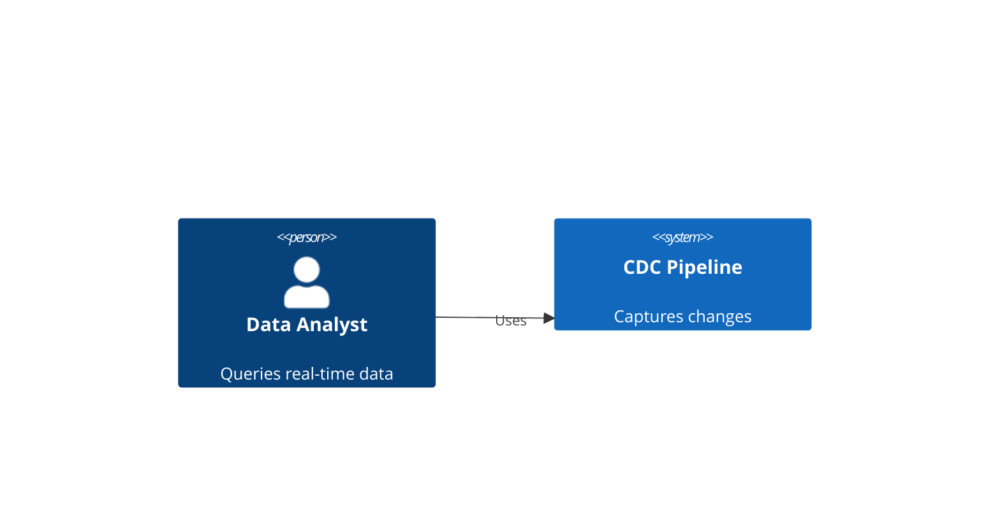
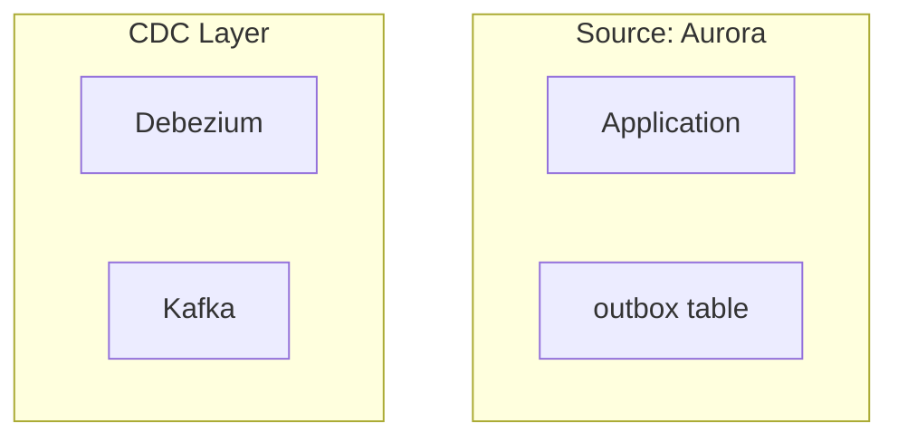

# Phase 35: Module 8 Diagram Migration - Research

**Researched:** 2026-02-02
**Domain:** Mermaid to Glass Diagram Migration (Capstone Module)
**Confidence:** HIGH

## Summary

Module 8 (Capstone) contains **8 Mermaid diagrams** across 5 MDX files focused on end-to-end CDC architecture, production readiness, and multi-database integration patterns. This is the smallest module in terms of diagram count, but the diagrams are architecturally significant - showing complete system context and multi-source CDC patterns.

The diagrams showcase capstone-level concepts:
- Full pipeline architecture (Aurora → Debezium → PyFlink → BigQuery)
- C4 Model architecture diagrams (System Context + Container)
- Multi-database CDC patterns (PostgreSQL + MySQL)
- Production maturity progression (local dev vs production)
- Unified monitoring architecture

All diagram patterns map to existing primitives from Phases 28-32. No new primitives needed. The focus is on comprehensive architecture visualization with professional C4-style layouts.

**Primary recommendation:** Reuse all existing primitives. Emphasize multi-source patterns and architectural layering. Capstone diagrams should demonstrate "putting it all together" - showing complete systems, not isolated components.

## Diagram Audit

### Total Count: 8 Mermaid diagrams

| Lesson | File | Diagrams | Primary Types |
|--------|------|----------|---------------|
| 01 | capstone-overview.mdx | 1 | flowchart (full pipeline architecture) |
| 02 | architecture-deliverables.mdx | 2 | C4Context, C4Container (architecture models) |
| 03 | self-assessment.mdx | 2 | flowchart (local vs prod gap, Four Golden Signals) |
| 04 | multi-database-architecture.mdx | 2 | flowchart (separate topics, unified topics patterns) |
| 05 | multi-database-configuration.mdx | 1 | flowchart (monitoring architecture) |

### Diagram Types Distribution

- **Flowcharts (flowchart TB/LR):** 6 diagrams
- **C4 Model (C4Context, C4Container):** 2 diagrams

**Note:** C4 diagrams are new syntax not seen in previous modules. This is Mermaid's C4 architecture diagram extension.

## Diagram Inventory by File

### 01-capstone-overview.mdx (1 diagram)

1. **Full Pipeline Architecture** (flowchart TB with subgraphs)
   - Shows: Complete end-to-end flow with 5 layers
   - Subgraphs: SOURCE (Aurora), CDC (Debezium), PROCESSING (PyFlink), WAREHOUSE (BigQuery), MONITORING (Prometheus/Grafana)
   - Complex multi-layer architecture with 10+ nodes
   - Color coding: blue (app), red (outbox), green (debezium), purple (pyflink), amber (bigquery), emerald (grafana)
   - **Significance:** "Hero diagram" showing entire system

### 02-architecture-deliverables.mdx (2 diagrams)

1. **C4 System Context** (C4Context)
   - Shows: External actors and system boundaries
   - Actors: Data Analyst (Person), CDC Pipeline (System), E-commerce App (System_Ext), BigQuery (System_Ext)
   - Relationships: Who uses what, data flow at system level
   - **New syntax:** `Person()`, `System()`, `System_Ext()`, `Rel()`
   - **Challenge:** Mermaid C4 extension - not standard flowchart

2. **C4 Container Diagram** (C4Container)
   - Shows: Internal components with technology details
   - Container types: ContainerDb, Container, ContainerQueue
   - Boundaries: Source, CDC Layer, Processing, Warehouse, Monitoring
   - **New syntax:** `Container_Boundary()`, `ContainerDb()`, `ContainerQueue()`
   - **Challenge:** Complex nested boundaries

### 03-self-assessment.mdx (2 diagrams)

1. **Local vs Production Gap** (flowchart LR with subgraphs)
   - Shows: Development (local works) vs Production (5 concerns)
   - Color contrast: amber (local) vs emerald (production aspects)
   - Simple comparison pattern

2. **Four Golden Signals** (flowchart TB with subgraphs)
   - Shows: Google SRE monitoring framework mapped to CDC
   - Two layers: Generic signals → CDC-specific metrics
   - Connections: Latency→Lag, Traffic→Throughput, etc.
   - Color coded: purple (signals), mapped to implementation

### 04-multi-database-architecture.mdx (2 diagrams)

1. **Separate Topics Architecture** (flowchart TB with subgraphs)
   - Shows: PostgreSQL + MySQL → Separate topics → PyFlink union
   - 4 subgraphs: SOURCES, CDC, TOPICS, CONSUMER
   - Multi-source pattern with distinct topic naming
   - Color coding: blue (postgres), red (mysql), green (connectors), purple (pyflink)
   - **Capstone pattern:** Multi-database integration

2. **Unified Topics Architecture** (flowchart TB with subgraphs)
   - Shows: PostgreSQL + MySQL → Single unified topic → PyFlink
   - Alternative pattern using ByLogicalTableRouter SMT
   - Simpler consumer, more complex coordination
   - **Capstone pattern:** Advanced SMT routing

### 05-multi-database-configuration.mdx (1 diagram)

1. **Monitoring Multi-Database Connectors** (flowchart TB with subgraphs)
   - Shows: PostgreSQL + MySQL monitoring → Prometheus → Grafana
   - 4 subgraphs: POSTGRES, MYSQL, PROMETHEUS, GRAFANA
   - Different metrics per database type (WAL lag vs time lag)
   - Color coded: postgres metrics green, mysql metrics red
   - **Capstone pattern:** Unified monitoring for heterogeneous sources

## C4 Model Diagrams: New Challenge

### What is C4?

C4 Model is a hierarchical architecture visualization approach:
- **Level 1 (Context):** System boundaries, external actors
- **Level 2 (Container):** Technology components, data flow
- **Level 3 (Component):** Internal class/module structure (not used in Module 8)
- **Level 4 (Code):** Implementation details (not used in Module 8)

### Mermaid C4 Syntax vs FlowNode Primitives

**Mermaid C4:**


**Glass Component Equivalent:**

C4 diagrams use specialized shapes (person icon, system box) that are **semantically different** from flowchart nodes. However, for implementation simplicity, we can use FlowNode variants with distinctive styling:

| C4 Element | FlowNode Mapping | Styling |
|------------|------------------|---------|
| Person() | FlowNode variant="app" | Could add person icon or distinct color |
| System() | FlowNode variant="connector" | Larger size, bold title |
| System_Ext() | FlowNode variant="sink" | Dashed border to show external |
| ContainerDb() | FlowNode variant="database" | Database icon/color |
| Container() | FlowNode variant="connector" | Standard container style |
| ContainerQueue() | FlowNode variant="cluster" | Queue/stream visual |

**Recommendation:** Map C4 elements to FlowNode variants with semantic naming. The content/tooltips will provide the architectural context.

## Diagram Patterns to Primitives Mapping

### Flowcharts -> FlowNode + Arrow + DiagramContainer

All 6 flowcharts map to established patterns:

| Mermaid Pattern | Primitive Composition |
|-----------------|----------------------|
| Pipeline with subgraphs | Multiple DiagramContainer stacked vertically |
| Multi-database sources | Side-by-side FlowNodes with color differentiation |
| Monitoring architecture | Vertical flow with branching at Prometheus |
| Comparison patterns | Side-by-side DiagramContainers (local vs prod) |

### C4 Diagrams -> Custom Layout Patterns

C4 diagrams require more structured layouts:

**System Context (high-level):**
```tsx
<DiagramContainer title="System Context" color="neutral">
  <div className="flex flex-col items-center gap-6">
    {/* Top: External actor */}
    <FlowNode variant="app">Data Analyst</FlowNode>
    <Arrow direction="down" label="Queries" />

    {/* Middle: System boundary */}
    <DiagramContainer color="blue" title="CDC Pipeline" className="w-full">
      <FlowNode variant="connector">Internal components...</FlowNode>
    </DiagramContainer>

    {/* Bottom: External systems */}
    <div className="flex gap-4">
      <FlowNode variant="sink">E-commerce App</FlowNode>
      <FlowNode variant="sink">BigQuery</FlowNode>
    </div>
  </div>
</DiagramContainer>
```

**Container Diagram (detailed):**
```tsx
<DiagramContainer title="Container Diagram" color="neutral">
  <div className="grid grid-cols-2 md:grid-cols-3 gap-4">
    {/* Source boundary */}
    <DiagramContainer color="purple" title="Source">
      <FlowNode variant="database">Aurora PostgreSQL</FlowNode>
      <FlowNode variant="connector">Outbox Table</FlowNode>
    </DiagramContainer>

    {/* CDC boundary */}
    <DiagramContainer color="emerald" title="CDC Layer">
      <FlowNode variant="connector">Debezium</FlowNode>
      <FlowNode variant="cluster">Kafka</FlowNode>
    </DiagramContainer>

    {/* Processing boundary */}
    <DiagramContainer color="purple" title="Processing">
      <FlowNode variant="connector">PyFlink</FlowNode>
    </DiagramContainer>

    {/* Warehouse boundary */}
    <DiagramContainer color="amber" title="Warehouse">
      <FlowNode variant="sink">BigQuery</FlowNode>
    </DiagramContainer>

    {/* Monitoring boundary */}
    <DiagramContainer color="blue" title="Monitoring">
      <FlowNode variant="sink">Prometheus</FlowNode>
      <FlowNode variant="connector">Grafana</FlowNode>
    </DiagramContainer>
  </div>
</DiagramContainer>
```

## Capstone-Specific Diagram Patterns

### Pattern 1: Full Pipeline "Hero Diagram"

The capstone overview diagram shows the ENTIRE system - all 5 layers. This is the culmination pattern:

```tsx
export function CapstoneArchitectureDiagram() {
  return (
    <div className="flex flex-col gap-4">
      {/* Layer 1: Source */}
      <DiagramContainer color="purple" title="Source: Aurora PostgreSQL">
        {/* App writes to orders + outbox */}
      </DiagramContainer>

      {/* Layer 2: CDC */}
      <DiagramContainer color="emerald" title="CDC Layer: Debezium">
        {/* Connector with SMT routing */}
      </DiagramContainer>

      {/* Layer 3: Processing */}
      <DiagramContainer color="purple" title="Stream Processing: PyFlink">
        {/* Transformations */}
      </DiagramContainer>

      {/* Layer 4: Warehouse */}
      <DiagramContainer color="amber" title="Analytics: BigQuery">
        {/* UPSERT/DELETE handling */}
      </DiagramContainer>

      {/* Layer 5: Monitoring */}
      <DiagramContainer color="blue" title="Observability">
        {/* Prometheus + Grafana */}
      </DiagramContainer>
    </div>
  );
}
```

**Design note:** Vertical stacking with arrows between layers. Each layer is a self-contained DiagramContainer.

### Pattern 2: Multi-Database Integration

Shows PostgreSQL + MySQL feeding into unified consumer:

```tsx
export function MultiDatabaseArchitectureDiagram() {
  return (
    <div className="grid grid-cols-1 md:grid-cols-2 gap-4">
      {/* Left: PostgreSQL path */}
      <div className="flex flex-col gap-2">
        <FlowNode variant="database" className="bg-blue-500/20 border-blue-400/30">
          PostgreSQL
        </FlowNode>
        <Arrow direction="down" label="WAL stream" />
        <FlowNode variant="connector">PG Connector</FlowNode>
        <Arrow direction="down" />
        <FlowNode variant="cluster">postgres_prod.public.orders</FlowNode>
      </div>

      {/* Right: MySQL path */}
      <div className="flex flex-col gap-2">
        <FlowNode variant="database" className="bg-red-500/20 border-red-400/30">
          MySQL
        </FlowNode>
        <Arrow direction="down" label="Binlog stream" />
        <FlowNode variant="connector">MySQL Connector</FlowNode>
        <Arrow direction="down" />
        <FlowNode variant="cluster">mysql_prod.inventory.stock</FlowNode>
      </div>

      {/* Bottom: Unified consumer */}
      <div className="col-span-2 flex justify-center">
        <FlowNode variant="connector" className="bg-purple-500/20 border-purple-400/30">
          PyFlink UNION ALL Consumer
        </FlowNode>
      </div>
    </div>
  );
}
```

**Design note:** Side-by-side sources converging to unified consumer. Color differentiation critical.

### Pattern 3: Maturity Progression

Local development vs production comparison:

```tsx
export function ProductionGapDiagram() {
  return (
    <div className="grid grid-cols-1 md:grid-cols-2 gap-4">
      <DiagramContainer color="amber" title="Local Development">
        <FlowNode variant="app">Code works in Docker Compose</FlowNode>
      </DiagramContainer>

      <DiagramContainer color="emerald" title="Production" recommended>
        <div className="flex flex-col gap-2">
          <FlowNode variant="connector">Monitoring</FlowNode>
          <FlowNode variant="connector">Fault Tolerance</FlowNode>
          <FlowNode variant="connector">Scalability</FlowNode>
          <FlowNode variant="connector">Operational Procedures</FlowNode>
          <FlowNode variant="connector">Documentation</FlowNode>
        </div>
      </DiagramContainer>
    </div>
  );
}
```

**Design note:** Contrast amber (incomplete) vs emerald (production-ready). Shows learning progression.

## Standard Stack

### Core (Already Established)

All primitives from Phases 28-32 are sufficient:

| Component | Purpose | Usage in Module 8 |
|-----------|---------|-------------------|
| FlowNode | Node boxes with variants | All architecture nodes |
| Arrow | Directional arrows | Layer connections, data flow |
| DiagramContainer | Glass wrapper with boundaries | Every diagram, nested for C4 |
| DiagramTooltip | Click/hover tooltips | Technology explanations |

### FlowNode Variants for Module 8

| Variant | Color | Use For |
|---------|-------|---------|
| database | Purple | PostgreSQL, MySQL, Aurora |
| connector | Emerald | Debezium, PyFlink, connectors |
| cluster | Emerald (brighter) | Kafka topics |
| sink | Blue | BigQuery, Prometheus, Grafana |
| app | Rose | Applications, failure states |
| target | Rose (brighter) | Critical endpoints |

### DiagramContainer Colors for Module 8

| Color | Use For |
|-------|---------|
| purple | Source databases, stream processing |
| emerald | CDC layer, recommended approaches |
| amber | Warehouse, warning states |
| blue | Monitoring, observability |
| rose | Problems, gaps in production readiness |
| neutral | System context, container diagrams |

## Architecture Patterns

### Recommended File Structure

```
src/components/diagrams/module8/
├── CapstoneArchitectureDiagrams.tsx    # Lesson 01 (1 diagram - hero)
├── C4ArchitectureDiagrams.tsx          # Lesson 02 (2 diagrams - C4 models)
├── ProductionReadinessDiagrams.tsx     # Lesson 03 (2 diagrams - maturity)
├── MultiDatabaseArchitectureDiagrams.tsx # Lesson 04 (2 diagrams - patterns)
├── MonitoringMultiDatabaseDiagrams.tsx # Lesson 05 (1 diagram - monitoring)
└── index.ts                            # Barrel export
```

**Rationale:**
- 5 files for 5 lessons (1:1 mapping)
- Clear semantic grouping
- Lesson 01 is "hero diagram" - keep isolated for prominence
- C4 diagrams isolated due to unique layout requirements

### Pattern: Layered Architecture with Subgraphs

Mermaid uses `subgraph` for grouping. Map to nested DiagramContainers:

**Mermaid:**


**Glass Component:**
```tsx
<div className="flex flex-col gap-4">
  <DiagramContainer color="purple" title="Source: Aurora">
    <div className="flex gap-3">
      <FlowNode variant="app">Application</FlowNode>
      <Arrow direction="right" />
      <FlowNode variant="connector">outbox table</FlowNode>
    </div>
  </DiagramContainer>

  <Arrow direction="down" label="WAL stream" />

  <DiagramContainer color="emerald" title="CDC Layer">
    <div className="flex gap-3">
      <FlowNode variant="connector">Debezium</FlowNode>
      <Arrow direction="right" />
      <FlowNode variant="cluster">Kafka</FlowNode>
    </div>
  </DiagramContainer>
</div>
```

### Pattern: C4 System Context

High-level system boundaries and actors:

```tsx
export function SystemContextDiagram() {
  return (
    <DiagramContainer title="System Context: E-commerce CDC Pipeline" color="neutral">
      <div className="flex flex-col items-center gap-6">
        {/* External actor */}
        <DiagramTooltip content="Data analyst queries real-time analytics">
          <FlowNode variant="app" className="rounded-full">
            Data Analyst
          </FlowNode>
        </DiagramTooltip>

        <Arrow direction="down" label="Queries real-time data" />

        {/* System boundary */}
        <div className="border-2 border-blue-400/30 rounded-lg p-6 bg-blue-500/10">
          <DiagramTooltip content="Captures and streams changes from Aurora to BigQuery">
            <FlowNode variant="connector" className="text-lg font-bold">
              CDC Pipeline
            </FlowNode>
          </DiagramTooltip>
        </div>

        <div className="flex gap-8">
          <div className="flex flex-col items-center gap-2">
            <Arrow direction="down" label="Writes to outbox" />
            <FlowNode variant="sink" className="border-dashed">
              E-commerce Application
            </FlowNode>
          </div>

          <div className="flex flex-col items-center gap-2">
            <Arrow direction="down" label="Streams CDC events" />
            <FlowNode variant="sink" className="border-dashed">
              BigQuery
            </FlowNode>
          </div>
        </div>
      </div>
    </DiagramContainer>
  );
}
```

**Design notes:**
- Rounded node for Person (actor)
- Border box for System (main focus)
- Dashed border for System_Ext (external systems)
- Larger font for system name

### Pattern: C4 Container Diagram

Component-level architecture with technology details:

```tsx
export function ContainerDiagram() {
  return (
    <DiagramContainer title="Container Diagram: CDC Pipeline Components" color="neutral">
      <div className="grid grid-cols-1 md:grid-cols-3 lg:grid-cols-5 gap-4">
        {/* Source boundary */}
        <DiagramContainer color="purple" title="Source" className="h-fit">
          <div className="flex flex-col gap-2">
            <DiagramTooltip content="Transactional database with logical replication">
              <FlowNode variant="database">
                Aurora PostgreSQL
                <div className="text-xs text-gray-400">Database</div>
              </FlowNode>
            </DiagramTooltip>
            <DiagramTooltip content="Transactional event publishing">
              <FlowNode variant="connector">
                Outbox Table
                <div className="text-xs text-gray-400">PostgreSQL Table</div>
              </FlowNode>
            </DiagramTooltip>
          </div>
        </DiagramContainer>

        {/* CDC Layer boundary */}
        <DiagramContainer color="emerald" title="CDC Layer" className="h-fit">
          <div className="flex flex-col gap-2">
            <DiagramTooltip content="Captures WAL changes with Outbox Event Router SMT">
              <FlowNode variant="connector">
                Debezium Connector
                <div className="text-xs text-gray-400">Kafka Connect</div>
              </FlowNode>
            </DiagramTooltip>
            <DiagramTooltip content="Durable event log">
              <FlowNode variant="cluster">
                Kafka
                <div className="text-xs text-gray-400">Event Streaming</div>
              </FlowNode>
            </DiagramTooltip>
          </div>
        </DiagramContainer>

        {/* Stream Processing boundary */}
        <DiagramContainer color="purple" title="Stream Processing" className="h-fit">
          <DiagramTooltip content="Transforms and enriches CDC events">
            <FlowNode variant="connector">
              PyFlink Job
              <div className="text-xs text-gray-400">Python/Flink</div>
            </FlowNode>
          </DiagramTooltip>
        </DiagramContainer>

        {/* Warehouse boundary */}
        <DiagramContainer color="amber" title="Analytics Warehouse" className="h-fit">
          <DiagramTooltip content="CDC-enabled tables with primary keys">
            <FlowNode variant="sink">
              BigQuery
              <div className="text-xs text-gray-400">Data Warehouse</div>
            </FlowNode>
          </DiagramTooltip>
        </DiagramContainer>

        {/* Monitoring boundary */}
        <DiagramContainer color="blue" title="Observability" className="h-fit">
          <div className="flex flex-col gap-2">
            <DiagramTooltip content="Scrapes JMX metrics">
              <FlowNode variant="sink">
                Prometheus
                <div className="text-xs text-gray-400">Metrics DB</div>
              </FlowNode>
            </DiagramTooltip>
            <DiagramTooltip content="Visualizes metrics">
              <FlowNode variant="connector">
                Grafana
                <div className="text-xs text-gray-400">Dashboards</div>
              </FlowNode>
            </DiagramTooltip>
          </div>
        </DiagramContainer>
      </div>
    </DiagramContainer>
  );
}
```

**Design notes:**
- Grid layout for horizontal container arrangement
- Each boundary is a DiagramContainer (nested)
- Technology labels in smaller text below component name
- Responsive grid (collapses on mobile)

## Don't Hand-Roll

| Problem | Don't Build | Use Instead | Why |
|---------|-------------|-------------|-----|
| C4 diagram shapes | Custom SVG or icons | FlowNode with className overrides | Consistency, responsive |
| Multi-layer layout | Complex CSS Grid | Stacked DiagramContainers | Semantic grouping |
| Nested boundaries | DIV soup | DiagramContainer (supports nesting) | Glass aesthetic |
| Source differentiation | Custom colors per instance | FlowNode className with bg override | Flexibility |

## Common Pitfalls

### Pitfall 1: C4 Syntax Misinterpretation
**What goes wrong:** Trying to directly convert C4 Mermaid syntax to JSX
**Why it happens:** C4Context/C4Container are Mermaid-specific, not standard HTML
**How to avoid:** Map C4 semantic elements to FlowNode variants, use layout for structure
**Warning signs:** Looking for "C4Context" component, copying Mermaid syntax

### Pitfall 2: Overcomplicated Hero Diagram
**What goes wrong:** Capstone architecture diagram becomes unreadable on mobile
**Why it happens:** Trying to show everything in one flat layout
**How to avoid:** Use vertical stacking of DiagramContainers, each layer self-contained
**Warning signs:** Horizontal scrolling, nodes overlapping

### Pitfall 3: Losing Multi-Database Source Attribution
**What goes wrong:** PostgreSQL and MySQL nodes look identical
**Why it happens:** Using same variant without color differentiation
**How to avoid:** Use className to override background colors (blue for PG, red for MySQL)
**Warning signs:** User can't tell which source is which

### Pitfall 4: C4 Container Grid Breaking on Small Screens
**What goes wrong:** 5-column layout cramped on mobile
**Why it happens:** Fixed grid-cols-5
**How to avoid:** Use responsive grid: `grid-cols-1 md:grid-cols-3 lg:grid-cols-5`
**Warning signs:** Tiny unreadable containers on mobile

### Pitfall 5: Missing Technology Labels in C4
**What goes wrong:** Container diagram doesn't show what technology each component uses
**Why it happens:** Only showing component name without technology detail
**How to avoid:** Add secondary text div with technology type (see Container Diagram pattern)
**Warning signs:** Diagram doesn't convey "Kafka Connect" vs "Python/Flink" distinction

## Code Examples

### Complete Capstone Hero Diagram

```tsx
// src/components/diagrams/module8/CapstoneArchitectureDiagrams.tsx
import { DiagramContainer } from '../primitives/DiagramContainer';
import { DiagramTooltip } from '../primitives/Tooltip';
import { FlowNode } from '../primitives/FlowNode';
import { Arrow } from '../primitives/Arrow';

export function CapstoneArchitectureDiagram() {
  return (
    <div className="flex flex-col gap-4">
      {/* Layer 1: Source */}
      <DiagramContainer color="purple" title="Source: Aurora PostgreSQL">
        <div className="flex items-center justify-center gap-3 flex-wrap">
          <DiagramTooltip content={
            <div>
              <strong>Application</strong>
              <p>Пишет заказы в orders table и события в outbox table</p>
              <p>В одной транзакции - атомарность гарантирована</p>
            </div>
          }>
            <FlowNode variant="app">Application</FlowNode>
          </DiagramTooltip>

          <Arrow direction="right" label="INSERT order" />

          <DiagramTooltip content={
            <div>
              <strong>orders table</strong>
              <p>Бизнес-данные: заказы клиентов</p>
            </div>
          }>
            <FlowNode variant="database">orders table</FlowNode>
          </DiagramTooltip>

          <div className="flex flex-col items-center gap-1">
            <div className="text-xs text-gray-400">same transaction</div>
            <Arrow direction="down" />
          </div>

          <DiagramTooltip content={
            <div>
              <strong>outbox table</strong>
              <p>Transactional event publishing pattern</p>
              <p>REPLICA IDENTITY FULL для CDC</p>
            </div>
          }>
            <FlowNode variant="connector" className="bg-red-500/20 border-red-400/30">
              outbox table
            </FlowNode>
          </DiagramTooltip>
        </div>
      </DiagramContainer>

      <Arrow direction="down" label="WAL stream" className="self-center" />

      {/* Layer 2: CDC */}
      <DiagramContainer color="emerald" title="CDC Layer: Debezium">
        <div className="flex items-center justify-center gap-3 flex-wrap">
          <DiagramTooltip content={
            <div>
              <strong>Debezium Connector</strong>
              <p>Захватывает события из outbox через WAL</p>
              <p>Outbox Event Router SMT роутирует по aggregatetype</p>
            </div>
          }>
            <FlowNode variant="connector">Debezium Connector<br/>
              <span className="text-xs text-gray-400">(Outbox Event Router SMT)</span>
            </FlowNode>
          </DiagramTooltip>

          <Arrow direction="right" label="Route events" />

          <DiagramTooltip content={
            <div>
              <strong>Kafka Topic</strong>
              <p>outbox.event.orders - роутированные события</p>
              <p>Durable log с at-least-once delivery</p>
            </div>
          }>
            <FlowNode variant="cluster">Kafka Topic<br/>
              <span className="text-xs text-gray-400">outbox.event.orders</span>
            </FlowNode>
          </DiagramTooltip>
        </div>
      </DiagramContainer>

      <Arrow direction="down" label="Consume CDC" className="self-center" />

      {/* Layer 3: Processing */}
      <DiagramContainer color="purple" title="Stream Processing: PyFlink">
        <div className="flex items-center justify-center gap-3 flex-wrap">
          <DiagramTooltip content={
            <div>
              <strong>PyFlink Table API</strong>
              <p>format='debezium-json' для автоматического парсинга</p>
              <p>Трансформации: enrichment, filtering, aggregation</p>
            </div>
          }>
            <FlowNode variant="connector">PyFlink Table API<br/>
              <span className="text-xs text-gray-400">(transformations)</span>
            </FlowNode>
          </DiagramTooltip>

          <Arrow direction="right" label="Publish enriched" />

          <DiagramTooltip content={
            <div>
              <strong>Kafka Sink Topic</strong>
              <p>bigquery.orders - обогащенные события</p>
              <p>Готовы для ingestion в warehouse</p>
            </div>
          }>
            <FlowNode variant="cluster">Kafka Topic<br/>
              <span className="text-xs text-gray-400">bigquery.orders</span>
            </FlowNode>
          </DiagramTooltip>
        </div>
      </DiagramContainer>

      <Arrow direction="down" label="Stream ingestion" className="self-center" />

      {/* Layer 4: Warehouse */}
      <DiagramContainer color="amber" title="Analytics: BigQuery">
        <div className="flex items-center justify-center gap-3 flex-wrap">
          <DiagramTooltip content={
            <div>
              <strong>BigQuery Connector</strong>
              <p>Storage Write API для CDC ingestion</p>
              <p>upsertEnabled=true для UPSERT/DELETE</p>
            </div>
          }>
            <FlowNode variant="sink">BigQuery Connector<br/>
              <span className="text-xs text-gray-400">(Storage Write API)</span>
            </FlowNode>
          </DiagramTooltip>

          <Arrow direction="right" label="UPSERT/DELETE" />

          <DiagramTooltip content={
            <div>
              <strong>BigQuery Table</strong>
              <p>project.dataset.orders с PRIMARY KEY</p>
              <p>CDC-enabled для UPSERT operations</p>
            </div>
          }>
            <FlowNode variant="target">BigQuery Table<br/>
              <span className="text-xs text-gray-400">project.dataset.orders</span>
            </FlowNode>
          </DiagramTooltip>
        </div>
      </DiagramContainer>

      <Arrow direction="down" label="Export metrics" className="self-center" />

      {/* Layer 5: Monitoring */}
      <DiagramContainer color="blue" title="Observability">
        <div className="flex items-center justify-center gap-3 flex-wrap">
          <DiagramTooltip content={
            <div>
              <strong>Prometheus</strong>
              <p>Скрапит JMX metrics от Debezium</p>
              <p>Scrape interval: 15s</p>
            </div>
          }>
            <FlowNode variant="sink">Prometheus<br/>
              <span className="text-xs text-gray-400">(JMX metrics)</span>
            </FlowNode>
          </DiagramTooltip>

          <Arrow direction="right" />

          <DiagramTooltip content={
            <div>
              <strong>Grafana</strong>
              <p>Dashboard с Four Golden Signals</p>
              <p>Alerts для connector failures и lag</p>
            </div>
          }>
            <FlowNode variant="connector">Grafana<br/>
              <span className="text-xs text-gray-400">(dashboards)</span>
            </FlowNode>
          </DiagramTooltip>
        </div>
      </DiagramContainer>
    </div>
  );
}
```

### MDX Integration Example

```mdx
---
title: "Capstone: End-to-End CDC Pipeline"
---

import { CapstoneArchitectureDiagram } from '../../../components/diagrams/module8/CapstoneArchitectureDiagrams';
import { SystemContextDiagram, ContainerDiagram } from '../../../components/diagrams/module8/C4ArchitectureDiagrams';

# Capstone: End-to-End CDC Pipeline

## Архитектура Pipeline

Полная архитектура capstone проекта:

<CapstoneArchitectureDiagram client:load />

## C4 Model Architecture

### System Context

<SystemContextDiagram client:load />

### Container Diagram

<ContainerDiagram client:load />
```

## Suggested Wave Groupings

Given 8 diagrams across 5 files, recommend **2 plans** (smallest module):

### Plan 35-01 (Wave 1): Lessons 01-03 (5 diagrams)
- CapstoneArchitectureDiagrams.tsx (1 diagram - hero)
- C4ArchitectureDiagrams.tsx (2 diagrams - C4 models)
- ProductionReadinessDiagrams.tsx (2 diagrams - maturity)
- **Theme:** Core capstone architecture and production readiness

### Plan 35-02 (Wave 2): Lessons 04-05 + MDX Migration (3 diagrams)
- MultiDatabaseArchitectureDiagrams.tsx (2 diagrams - multi-source patterns)
- MonitoringMultiDatabaseDiagrams.tsx (1 diagram - unified monitoring)
- Update all 5 MDX files to use glass components
- **Theme:** Multi-database extension and MDX migration

**Rationale:**
- Wave 1 = foundational diagrams (single-source capstone)
- Wave 2 = advanced extension (multi-database optional)
- Small scope allows parallel work with other phases

## Russian Tooltip Content Examples

### Capstone Architecture
- "Outbox Pattern обеспечивает transactional consistency: событие публикуется атомарно с бизнес-операцией"
- "Outbox Event Router SMT роутирует события по aggregatetype field в правильные топики"
- "PyFlink format='debezium-json' автоматически парсит CDC envelope (before/after/op)"
- "BigQuery PRIMARY KEY (NOT ENFORCED) критичен для CDC UPSERT operations"
- "Storage Write API обеспечивает потоковую ingestion с низкой latency"

### C4 Architecture
- "System Context показывает внешние актеры и границы системы"
- "Container Diagram детализирует компоненты и технологии"
- "Person = внешний актер (аналитик, разработчик, оператор)"
- "System_Ext = внешние системы вне нашего контроля (BigQuery, Aurora)"

### Production Readiness
- "Local development: 'работает на laptop' ≠ production-ready"
- "Production требует: monitoring, fault tolerance, documentation, runbook"
- "Four Golden Signals: Latency, Traffic, Errors, Saturation"
- "Replication lag = PRIMARY metric для CDC latency"
- "At-least-once delivery + idempotency = no data loss, no duplicates"

### Multi-Database
- "Separate Topics: независимая schema evolution, clear source attribution"
- "Unified Topics: требует identical schemas, careful key design"
- "database.server.name MUST be unique per connector: postgres_prod vs mysql_prod"
- "schema.history.internal.kafka.topic MUST be unique per MySQL connector"
- "PostgreSQL lag = байты WAL, MySQL lag = миллисекунды времени"
- "source_database column критичен для traceability в multi-source pipeline"

## Open Questions

1. **C4 Person Icon Representation**
   - What we know: C4 uses person icon for actors
   - What's unclear: Should we add icon to FlowNode or just use rounded shape?
   - Recommendation: Use rounded FlowNode with "Person:" prefix in text - icons add complexity

2. **Container Diagram Grid Responsiveness**
   - What we know: 5 boundaries in Container Diagram
   - What's unclear: Optimal mobile breakpoint strategy
   - Recommendation: Test with grid-cols-1 md:grid-cols-2 lg:grid-cols-5 (stack on mobile)

3. **Multi-Database Color Consistency**
   - What we know: PostgreSQL = blue, MySQL = red in diagrams
   - What's unclear: Should this be enforced in FlowNode variants or className?
   - Recommendation: Use className for database-specific colors (more flexible)

## Sources

### Primary (HIGH confidence)
- Module 8 MDX files (audited directly) - All 5 lessons
- Phase 30-32 RESEARCH.md (established patterns)
- Existing primitives source code (FlowNode.tsx, DiagramContainer.tsx)

### Secondary (MEDIUM confidence)
- Mermaid C4 extension documentation (for C4Context/C4Container syntax understanding)

## Metadata

**Confidence breakdown:**
- Diagram audit: HIGH - Direct file inspection of all 5 lessons
- Primitive mapping: HIGH - All patterns map to existing primitives
- C4 diagram handling: MEDIUM - New syntax, but maps to FlowNode + layout
- Tooltip content: HIGH - Extracted from MDX explanatory text
- Wave groupings: HIGH - Small scope, clear thematic split

**Research date:** 2026-02-02
**Valid until:** 2026-03-02 (stable patterns, capstone module unlikely to change)

## Summary Table

| Metric | Value | Notes |
|--------|-------|-------|
| **Total diagrams** | 8 | Smallest module |
| **Flowcharts** | 6 | Standard patterns |
| **C4 diagrams** | 2 | New syntax, maps to primitives |
| **Sequence diagrams** | 0 | None in Module 8 |
| **Lessons covered** | 5 | 01-05 |
| **New primitives needed** | 0 | Reuse all existing |
| **Recommended plans** | 2 | Wave 1 (5 diagrams), Wave 2 (3 + MDX) |
| **Complexity** | Medium-High | Hero diagram + C4 models complex |
| **Capstone patterns** | 3 | Full pipeline, multi-database, maturity progression |
