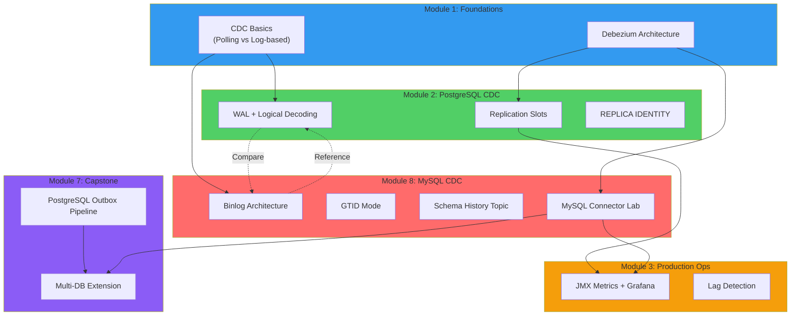

# Architecture Patterns: MySQL/Aurora MySQL CDC Module Integration

**Domain:** Debezium CDC Course - MySQL Module
**Researched:** 2026-02-01
**Confidence:** HIGH

## Executive Recommendation

**Add MySQL/Aurora MySQL as Module 8** (after existing 7 modules), not inserted between modules 2-3.

**Rationale:**
1. **Parallel learning path** - MySQL CDC is a separate database technology track, not a prerequisite for modules 3-7
2. **Existing Capstone integrity** - Module 7 focuses on PostgreSQL → Outbox → PyFlink → BigQuery; inserting MySQL mid-course would fragment this narrative
3. **Optional specialization** - Students can choose PostgreSQL-only path (modules 1-7) or add MySQL specialization (module 8)
4. **Minimal disruption** - Existing module numbers remain stable, no content reorganization required

---

## Recommended Architecture: Module 8 Structure

### Module 8: MySQL/Aurora MySQL CDC

**Position:** Final module (after Module 7: Capstone)
**Structure:** Standalone specialization module with 5-6 lessons + optional capstone extension

### Lesson Structure (5-6 lessons)

| Lesson | Title | Estimated Time | Difficulty |
|--------|-------|----------------|------------|
| 01 | **Binlog Deep Dive** | 25 min | Intermediate |
| 02 | **MySQL Binlog vs PostgreSQL WAL** | 20 min | Intermediate |
| 03 | **Aurora MySQL Binlog Configuration** | 30 min | Intermediate |
| 04 | **MySQL Connector Setup Lab** | 35 min | Intermediate |
| 05 | **Schema History Topic Management** | 25 min | Advanced |
| 06 | **MySQL Capstone Extension (Optional)** | 30 min | Advanced |

**Total:** 165 minutes (~2.75 hours of content)

---

## Content Pattern: Russian Explanatory + English Code

Following existing course convention established in modules 1-7:

```mdx
---
title: "Binlog: архитектура и форматы записи"
description: "MySQL binlog vs PostgreSQL WAL, форматы ROW/STATEMENT/MIXED, GTID mode"
order: 1
difficulty: "intermediate"
estimatedTime: 25
topics: ["binlog", "mysql-cdc", "gtid", "replication"]
prerequisites: ["module-2/01-logical-decoding-deep-dive"]
---

# Binlog: архитектура и форматы записи

Если PostgreSQL использует WAL + logical decoding для CDC, то MySQL имеет
встроенный механизм logical replication через **binary log (binlog)**.

## Форматы Binlog

```sql
-- Проверить текущий формат binlog
SHOW VARIABLES LIKE 'binlog_format';
```
```

**Key consistency patterns:**
- Russian prose for explanations and concepts
- English for code, configuration, technical terms
- Mermaid diagrams for architecture visualization
- Code blocks with syntax highlighting

---

## Lab Integration Strategy

**Recommendation: Extend existing docker-compose.yml with MySQL service**

### Option A: Single Shared Infrastructure (RECOMMENDED)

**Why:** Simpler for students, demonstrates multi-database CDC in single environment

**Implementation:**
```yaml
# labs/docker-compose.yml - ADD MySQL service

  mysql:
    image: mysql:${MYSQL_VERSION}
    container_name: mysql
    ports:
      - "${MYSQL_PORT}:3306"
    environment:
      MYSQL_ROOT_PASSWORD: ${MYSQL_PASSWORD}
      MYSQL_DATABASE: ${MYSQL_DB}
    command:
      - "--log-bin=mysql-bin"
      - "--binlog-format=ROW"
      - "--binlog-row-image=FULL"
      - "--gtid-mode=ON"
      - "--enforce-gtid-consistency=ON"
      - "--server-id=1"
    volumes:
      - mysql-data:/var/lib/mysql
      - ./mysql/init.sql:/docker-entrypoint-initdb.d/init.sql
    healthcheck:
      test: ["CMD", "mysqladmin", "ping", "-h", "localhost"]
      interval: 5s
      timeout: 5s
      retries: 5
```

**Directory structure addition:**
```
labs/
├── docker-compose.yml          # Extended with mysql service
├── postgres/
│   └── init.sql
├── mysql/                      # NEW
│   └── init.sql                # MySQL-specific schema
├── notebooks/
│   ├── 01-setup-verification.ipynb
│   └── 08-mysql-connector-setup.ipynb  # NEW
└── schemas/
    └── mysql-inventory.sql     # NEW
```

**Advantages:**
- Single `docker compose up` starts all infrastructure
- Students see multi-database CDC in practice
- Reuses existing Kafka, Connect, monitoring stack
- Real-world pattern: one Kafka cluster, multiple source databases

**Port allocation:**
- PostgreSQL: 5433 (existing)
- MySQL: 3307 (avoid conflict with local MySQL on 3306)
- Kafka: 9092 (existing)
- Connect: 8083 (existing)

### Option B: Separate MySQL Lab Environment

**Why NOT recommended:**
- Duplicates infrastructure (Kafka, Connect, monitoring)
- Students must run two separate docker-compose stacks
- Does not reflect production pattern (consolidation)
- Increases resource requirements

**When to use:** Only if course wants to demonstrate MySQL-only CDC setup separately

---

## Module 8 Detailed Lesson Breakdown

### Lesson 01: Binlog Deep Dive (25 min)

**Learning objectives:**
- Understand MySQL binlog architecture
- Compare binlog formats: ROW vs STATEMENT vs MIXED
- Learn GTID (Global Transaction Identifier) mode
- Explore binlog retention and purging

**Key concepts:**
- Binary log structure (binlog files + binlog index)
- Log positions vs GTIDs
- `binlog_row_image` settings (FULL, MINIMAL, NOBLOB)
- `binlog_row_metadata` for column names

**Code examples:**
```sql
-- Check binlog status
SHOW BINARY LOGS;
SHOW MASTER STATUS;

-- View binlog events
SHOW BINLOG EVENTS IN 'mysql-bin.000001' LIMIT 10;

-- GTID executed set
SHOW GLOBAL VARIABLES LIKE 'gtid_executed';
```

**Prerequisites from Module 2:**
- Understanding of transaction logs (WAL in PostgreSQL)
- Logical vs physical replication concepts
- LSN (Log Sequence Number) concept translates to binlog position/GTID

---

### Lesson 02: MySQL Binlog vs PostgreSQL WAL (20 min)

**Learning objectives:**
- Compare CDC mechanisms: binlog (MySQL) vs WAL + logical decoding (PostgreSQL)
- Understand architectural differences
- Know when to choose each database for CDC use cases

**Comparison table:**

| Aspect | PostgreSQL WAL + Logical Decoding | MySQL Binlog |
|--------|-----------------------------------|--------------|
| **Primary purpose** | Crash recovery (WAL) + replication (logical decoding) | Replication + point-in-time recovery |
| **CDC readiness** | Requires `wal_level=logical` + output plugin | Built-in with `binlog_format=ROW` |
| **Schema changes** | Captured via pgoutput plugin | Captured directly in binlog events |
| **Output plugin** | pgoutput, wal2json, decoderbufs | Not needed (binlog is already logical) |
| **Position tracking** | LSN (Log Sequence Number) | Binlog position OR GTID |
| **Replication identity** | REPLICA IDENTITY (DEFAULT, FULL, INDEX) | Primary key (or all columns if no PK) |
| **Snapshot locking** | `REPEATABLE READ` transaction | `FLUSH TABLES WITH READ LOCK` (default) |
| **Schema history** | Inline in WAL stream | Separate schema history topic required |

**Key insight:**
> **MySQL binlog is inherently logical,** while PostgreSQL WAL is physical (requiring logical decoding layer). This means MySQL CDC setup is conceptually simpler, but requires careful schema history management.

**Mermaid diagram:**
```
PostgreSQL CDC:
App → PostgreSQL → WAL (physical) → Logical Decoding → pgoutput → Debezium → Kafka

MySQL CDC:
App → MySQL → Binlog (logical) → Debezium → Kafka
                                 ↓
                          Schema History Topic
```

---

### Lesson 03: Aurora MySQL Binlog Configuration (30 min)

**Learning objectives:**
- Configure Aurora MySQL parameter groups for CDC
- Set binlog retention policies
- Understand Aurora-specific limitations
- Create replication user with correct privileges

**Aurora-specific considerations:**

1. **Parameter Group Settings (Static - requires reboot):**
   ```sql
   -- Via AWS RDS parameter group:
   binlog_format = ROW
   binlog_row_image = FULL
   binlog_row_metadata = FULL  -- MySQL 8.0+
   gtid_mode = ON
   enforce_gtid_consistency = ON
   ```

2. **Binlog Retention (Dynamic - via procedure):**
   ```sql
   -- Aurora MySQL specific: max 168 hours (7 days)
   CALL mysql.rds_set_configuration('binlog retention hours', 168);

   -- Verify retention
   CALL mysql.rds_show_configuration;
   ```

3. **Replication User Permissions:**
   ```sql
   CREATE USER 'debezium'@'%' IDENTIFIED BY 'strong_password_here';

   -- Required for CDC
   GRANT REPLICATION SLAVE, REPLICATION CLIENT ON *.* TO 'debezium'@'%';
   GRANT SELECT ON *.* TO 'debezium'@'%';  -- For snapshot

   -- Optional: specific database
   GRANT SELECT ON inventory.* TO 'debezium'@'%';
   ```

4. **Aurora-Specific Limitations:**
   - Must connect to **writer endpoint** (not reader)
   - Binlog generated only on primary instance
   - Read replicas do not have accessible binlog
   - Binlog retention max 7 days (vs unlimited for self-managed MySQL)

**Lab exercise:**
- Launch Aurora MySQL via AWS Console or Terraform
- Configure parameter group
- Set binlog retention
- Verify binlog accessibility

**References:**
- [Aurora MySQL CDC Setup Guide](https://olake.io/docs/connectors/mysql/setup/aurora/)
- [AWS Aurora MySQL CDC Configuration](https://streams.dbconvert.com/docs/connections/aws-aurora-mysql)
- [Debezium MySQL Connector Documentation](https://debezium.io/documentation/reference/stable/connectors/mysql.html)

---

### Lesson 04: MySQL Connector Setup Lab (35 min)

**Learning objectives:**
- Deploy Debezium MySQL connector to existing Kafka Connect
- Configure snapshot modes
- Understand schema history topic
- Monitor binlog position tracking

**Connector configuration:**

```json
{
  "name": "mysql-inventory-connector",
  "config": {
    "connector.class": "io.debezium.connector.mysql.MySqlConnector",
    "database.hostname": "mysql",
    "database.port": "3306",
    "database.user": "debezium",
    "database.password": "debezium",
    "database.server.id": "184054",
    "topic.prefix": "mysql",
    "database.include.list": "inventory",
    "table.include.list": "inventory.customers,inventory.orders",

    "schema.history.internal.kafka.bootstrap.servers": "kafka:9092",
    "schema.history.internal.kafka.topic": "schema-changes.inventory",

    "snapshot.mode": "initial",
    "snapshot.locking.mode": "minimal",

    "binlog.row.metadata": "FULL",
    "include.schema.changes": "true",
    "time.precision.mode": "adaptive_time_microseconds"
  }
}
```

**Key differences from PostgreSQL connector:**

| Configuration | PostgreSQL | MySQL |
|---------------|------------|-------|
| Plugin name | `plugin.name: "pgoutput"` | Not applicable (binlog is native) |
| Publication | `publication.name: "dbz_publication"` | Not applicable |
| Replication slot | Auto-created | Not applicable |
| Schema history | Inline in WAL | **Separate Kafka topic required** |
| Snapshot locking | `snapshot.locking.mode` available | `snapshot.locking.mode: "minimal"` recommended |
| Server ID | Not needed | `database.server.id` **required** (unique per connector) |

**Schema history topic:**

Critical difference: MySQL connector **requires** a Kafka topic to store schema changes (DDL events), because binlog contains DDL but Debezium needs persistent schema state.

```bash
# View schema history topic
kafka-console-consumer --bootstrap-server kafka:9092 \
  --topic schema-changes.inventory \
  --from-beginning
```

**Snapshot modes:**

| Mode | Use Case | When Connector Starts |
|------|----------|----------------------|
| `initial` (default) | First-time setup | Full snapshot + binlog streaming |
| `schema_only` | Schema without data | Capture schema, skip data snapshot |
| `never` | Resume from existing binlog | No snapshot, start from binlog position |
| `when_needed` | Recover if no binlog position | Snapshot only if offset missing |

**Lab exercise:**
1. Create MySQL connector via REST API
2. Verify snapshot completion
3. Insert data into MySQL
4. Consume CDC events from Kafka
5. Compare event structure with PostgreSQL CDC events

---

### Lesson 05: Schema History Topic Management (25 min)

**Learning objectives:**
- Understand why MySQL connector needs schema history topic
- Manage schema evolution scenarios
- Handle schema history corruption
- Best practices for production

**Why schema history topic exists:**

PostgreSQL connectors embed schema metadata in WAL via logical decoding. MySQL's binlog contains DDL events, but Debezium needs to reconstruct table schemas **at any binlog position** for recovery scenarios.

**Schema history topic content:**

```json
{
  "source": {
    "server": "mysql"
  },
  "position": {
    "file": "mysql-bin.000003",
    "pos": 154,
    "gtids": "3E11FA47-71CA-11E1-9E33-C80AA9429562:1-5"
  },
  "databaseName": "inventory",
  "ddl": "CREATE TABLE customers (id INT PRIMARY KEY, name VARCHAR(255))",
  "tableChanges": [ ... ]
}
```

**Common scenarios:**

1. **Connector restart:** Reads schema history topic to rebuild in-memory schema representation
2. **DDL changes:** Appends new DDL to schema history topic
3. **Recovery:** Replays schema history from beginning to reconstruct state

**Production best practices:**

```json
{
  "schema.history.internal.kafka.topic": "schema-changes.inventory",
  "schema.history.internal.kafka.bootstrap.servers": "kafka:9092",
  "schema.history.internal.kafka.recovery.attempts": "100",
  "schema.history.internal.kafka.recovery.poll.interval.ms": "500",

  // Production: increase retention (default: 7 days)
  "schema.history.internal.kafka.topic.replication.factor": "3",
  "schema.history.internal.kafka.topic.retention.ms": "31536000000"  // 1 year
}
```

**Troubleshooting schema history corruption:**

```bash
# If schema history topic is corrupted or deleted:
# Option 1: Recreate connector with snapshot.mode=schema_only_recovery
{
  "snapshot.mode": "schema_only_recovery"
}

# Option 2: Delete connector, delete schema history topic, recreate from initial
```

**References:**
- [Debezium MySQL Schema History Documentation](https://debezium.io/documentation/reference/stable/connectors/mysql.html)

---

### Lesson 06: MySQL Capstone Extension (Optional) (30 min)

**Learning objectives:**
- Extend Module 7 Capstone to support MySQL source
- Demonstrate multi-database CDC pipeline
- Compare PostgreSQL Outbox vs MySQL-native CDC

**Capstone extension architecture:**

```
Original Capstone (Module 7):
Aurora PostgreSQL → Outbox Table → Debezium (pgoutput) → Kafka → PyFlink → BigQuery

Extended Capstone (Module 8):
Aurora PostgreSQL → Outbox Table → Debezium (pgoutput) ┐
                                                        ├→ Kafka → PyFlink → BigQuery
Aurora MySQL       → Direct CDC  → Debezium (binlog)   ┘
```

**Use case: Multi-database e-commerce**

- **PostgreSQL:** Order transactions (using Outbox pattern for transactional guarantees)
- **MySQL:** Product catalog (direct CDC, no transactional events needed)
- **PyFlink:** Join order events with product catalog enrichment
- **BigQuery:** Unified analytics warehouse

**PyFlink transformation:**

```python
# Consume from both PostgreSQL and MySQL topics
orders_table = table_env.from_path("orders")  # PostgreSQL Outbox events
products_table = table_env.from_path("products")  # MySQL CDC events

# Join order events with product details
enriched_orders = table_env.sql_query("""
    SELECT
        o.order_id,
        o.customer_id,
        p.product_name,
        p.price,
        o.quantity,
        o.order_timestamp
    FROM orders AS o
    LEFT JOIN products AS p
    ON o.product_id = p.id
""")

# Sink to BigQuery
enriched_orders.execute_insert("bigquery_orders").wait()
```

**When to use this pattern:**

- Multi-database architecture (microservices with different databases)
- PostgreSQL for transactional workloads (Outbox for consistency)
- MySQL for read-heavy catalogs (direct CDC simpler than Outbox)

**Deliverables:**
- Extended docker-compose with MySQL service
- MySQL connector configuration
- PyFlink job consuming both PostgreSQL and MySQL topics
- BigQuery schema supporting both sources
- Documentation explaining multi-database CDC pattern

---

## Integration Points with Existing Modules

### Module 1: Foundations
**Reuse:**
- CDC fundamentals (log-based replication concept)
- Debezium architecture (MySQL connector is another connector type)
- First connector lab (extend with MySQL example)

**Addition:**
- Add MySQL to comparison table in Lesson 01 (CDC fundamentals)

### Module 2: PostgreSQL/Aurora CDC
**Reference:**
- Lesson 02 (MySQL vs PostgreSQL) references Module 2 extensively
- Parallel structure: Module 2 = PostgreSQL deep dive, Module 8 = MySQL deep dive

### Module 3: Production Operations
**Reuse:**
- JMX metrics (same for MySQL connector)
- Prometheus/Grafana monitoring
- Lag detection and alerting

**MySQL-specific addition:**
- Binlog position monitoring (vs replication slot monitoring)
- Schema history topic size monitoring

### Module 4: Advanced Patterns
**Discussion:**
- Outbox pattern is PostgreSQL-focused (transactional guarantees)
- MySQL can use Outbox, but less common (binlog already logical)
- Lesson 06 (Capstone Extension) shows when to use Outbox vs direct CDC

### Module 5: Data Engineering
**Reuse:**
- PyFlink CDC connector supports both PostgreSQL and MySQL
- Debezium JSON format is identical
- Same transformation patterns apply

### Module 6: Cloud-Native GCP
**Parallel:**
- Cloud SQL MySQL (equivalent to Cloud SQL PostgreSQL in Module 6)
- Same Debezium Server + Pub/Sub pattern
- Same BigQuery ingestion

### Module 7: Capstone
**Extension:**
- Lesson 06 (MySQL Capstone Extension) adds MySQL source to existing pipeline
- Demonstrates multi-database CDC best practices

---

## Data Flow Diagram: MySQL Module in Course Context



---

## Build Order Recommendation

Given existing course structure, recommended build order for Module 8:

### Phase 1: Core Content (Week 1-2)
1. Write Lesson 01: Binlog Deep Dive
2. Write Lesson 02: MySQL vs PostgreSQL comparison
3. Extend labs/docker-compose.yml with MySQL service
4. Create labs/mysql/init.sql schema

### Phase 2: Aurora MySQL (Week 3)
5. Write Lesson 03: Aurora MySQL configuration
6. Document Aurora parameter group setup
7. Create Terraform/CloudFormation templates (optional)

### Phase 3: Hands-on Lab (Week 4)
8. Write Lesson 04: MySQL Connector Setup Lab
9. Create notebooks/08-mysql-connector-setup.ipynb
10. Test connector configuration end-to-end

### Phase 4: Advanced Topics (Week 5)
11. Write Lesson 05: Schema History Topic Management
12. Document troubleshooting scenarios
13. Create monitoring dashboard for MySQL-specific metrics

### Phase 5: Capstone Extension (Week 6 - Optional)
14. Write Lesson 06: MySQL Capstone Extension
15. Create multi-database PyFlink example
16. Document multi-DB CDC best practices

**Total estimate:** 5-6 weeks for full module

---

## Anti-Patterns to Avoid

### Anti-Pattern 1: Inserting MySQL Between PostgreSQL Modules

**What:** Placing MySQL as Module 3 (after Module 2: PostgreSQL CDC)

**Why bad:**
- Breaks existing module flow (Module 3 = Production Ops builds on Module 2)
- Forces renumbering of all subsequent modules
- Students learning PostgreSQL path must navigate MySQL content unnecessarily
- Existing module references (prerequisites) all break

**Instead:** Add as Module 8, allowing parallel learning paths

---

### Anti-Pattern 2: Separate MySQL Lab Environment

**What:** Creating labs-mysql/ directory with duplicate docker-compose.yml

**Why bad:**
- Doubles resource requirements (two Kafka clusters, two Connect instances)
- Does not reflect production reality (single Kafka for multiple sources)
- Students must manage two separate environments
- Misses opportunity to teach multi-database CDC patterns

**Instead:** Extend existing docker-compose.yml with MySQL service

---

### Anti-Pattern 3: Treating MySQL as "PostgreSQL Equivalent"

**What:** Directly translating PostgreSQL lessons to MySQL without addressing architectural differences

**Why bad:**
- MySQL binlog is fundamentally different from PostgreSQL WAL + logical decoding
- Schema history topic is MySQL-specific (no equivalent in PostgreSQL connector)
- GTID vs LSN position tracking differs
- Snapshot modes and locking strategies differ

**Instead:**
- Lesson 02 explicitly compares architectures
- Each lesson highlights MySQL-specific patterns
- Reference PostgreSQL concepts but don't assume equivalence

---

### Anti-Pattern 4: Skipping Schema History Topic

**What:** Not dedicating a lesson to schema history topic management

**Why bad:**
- Schema history topic is **critical** for MySQL connector reliability
- Corruption or deletion causes connector failure
- Production issue #1 for MySQL connectors (per community discussions)
- Students won't understand why connector won't restart after DDL changes

**Instead:** Lesson 05 dedicated entirely to schema history topic

---

### Anti-Pattern 5: Aurora MySQL as Primary Example

**What:** Teaching Aurora MySQL exclusively, skipping self-managed MySQL

**Why bad:**
- Aurora has specific limitations (7-day binlog retention, writer-only access)
- Students without AWS can't practice
- Aurora parameter groups add complexity
- Reboot requirement for binlog_format change

**Instead:**
- Lesson 04 uses Docker MySQL (accessible to all)
- Lesson 03 covers Aurora-specific considerations separately

---

## Scalability Considerations

### At 100 Students (Current Course Scale)

**Lab infrastructure:**
- Single shared docker-compose environment handles both PostgreSQL and MySQL
- Total containers: 8 (postgres, mysql, kafka, connect, schema-registry, prometheus, grafana, jupyter)
- Memory requirement: ~10 GB (2 GB increase from adding MySQL)

**Module ordering impact:**
- Module 8 placement means students can complete course without MySQL (PostgreSQL-only path)
- No disruption to existing 100+ students who completed modules 1-7

### At 10K Students (MOOC Scale)

**Content delivery:**
- Static Astro site scales infinitely (CDN)
- Docker Compose patterns well-documented for self-hosting

**Lab options:**
- Students run labs locally (current pattern)
- Cloud lab environments (Instruqt, Katacoda) pre-provisioned
- Module 8 optional specialization track

### At 100K Students (Enterprise Training)

**Course variants:**
- Track 1: PostgreSQL CDC (Modules 1-7)
- Track 2: MySQL CDC (Modules 1, 3-7 adapted, 8)
- Track 3: Multi-Database CDC (All modules)

**Certification paths:**
- "Debezium PostgreSQL Specialist" (Modules 1-7)
- "Debezium MySQL Specialist" (Modules 1, 8 + adapted content)
- "Debezium Multi-Database Architect" (All modules + Capstone Extension)

---

## Production Patterns for Module 8

### Pattern 1: Multi-Database CDC Hub

**Use case:** Enterprise with PostgreSQL + MySQL sources

```
PostgreSQL Services → Debezium Postgres Connector ┐
MySQL Services      → Debezium MySQL Connector    ├→ Single Kafka Cluster → Consumers
MongoDB Services    → Debezium MongoDB Connector  ┘
```

**When to use:**
- Microservices with different database technologies
- Data lake/warehouse ingestion from heterogeneous sources
- Event-driven architecture aggregating events from multiple systems

**Module 8 teaches:** How MySQL fits into this architecture

---

### Pattern 2: MySQL Binlog-Based Outbox

**Use case:** MySQL application with transactional event publishing

```
MySQL Transaction:
  1. INSERT INTO orders (customer_id, amount) VALUES (123, 99.99);
  2. INSERT INTO outbox (aggregate_type, aggregate_id, event_type, payload)
     VALUES ('Order', LAST_INSERT_ID(), 'OrderCreated', '{"amount": 99.99}');
  COMMIT;

Debezium MySQL Connector:
  → Captures both orders and outbox table changes
  → Outbox Event Router SMT routes events to appropriate topics
```

**When to use:**
- MySQL as source database (not PostgreSQL)
- Need transactional guarantees for event publishing
- Polyglot persistence (some services on MySQL, some on PostgreSQL)

**Module 8 teaches:** MySQL + Outbox pattern (references Module 4)

---

### Pattern 3: Cloud SQL MySQL → GCP Native Ingestion

**Use case:** Google Cloud environment with Cloud SQL MySQL

```
Cloud SQL MySQL → Debezium Server → Pub/Sub → Dataflow → BigQuery
```

**Configuration:**
- Cloud SQL MySQL with binlog enabled
- Debezium Server in Cloud Run
- IAM Workload Identity for authentication

**Module 8 teaches:** Parallel to Module 6 (which uses Cloud SQL PostgreSQL)

---

## Sources

Architecture research based on:

### Official Documentation (HIGH confidence)
- [Debezium MySQL Connector Documentation](https://debezium.io/documentation/reference/stable/connectors/mysql.html)
- [MySQL CDC Source V2 Connector](https://docs.confluent.io/cloud/current/connectors/cc-mysql-source-cdc-v2-debezium/cc-mysql-source-cdc-v2-debezium.html)
- [Confluent MySQL Configuration Reference](https://docs.confluent.io/kafka-connectors/debezium-mysql-source/current/mysql_source_connector_config.html)

### Aurora MySQL CDC (MEDIUM confidence - verified with multiple sources)
- [Aurora MySQL CDC Setup Guide - OLake](https://olake.io/docs/connectors/mysql/setup/aurora/)
- [AWS Aurora MySQL CDC Setup - DBConvert](https://streams.dbconvert.com/docs/connections/aws-aurora-mysql)
- [Aurora MySQL CDC - Decodable](https://docs.decodable.co/howto/how-to-set-up-an-aws-aurora-mysql-cdc-connection.html)

### MySQL vs PostgreSQL CDC (MEDIUM confidence - community analysis)
- [MySQL binlog vs PostgreSQL WAL Comparison](https://medium.com/data-science/understanding-change-data-capture-cdc-in-mysql-and-postgresql-binlog-vs-wal-logical-decoding-ac76adb0861f)
- [MySQL Replication vs PostgreSQL Replication](https://vivekbansal.substack.com/p/mysql-vs-postgresql-replication)

### Production Best Practices (MEDIUM confidence - Materialize guide)
- [MySQL CDC with Debezium in Production](https://materialize.com/guides/mysql-cdc/)
